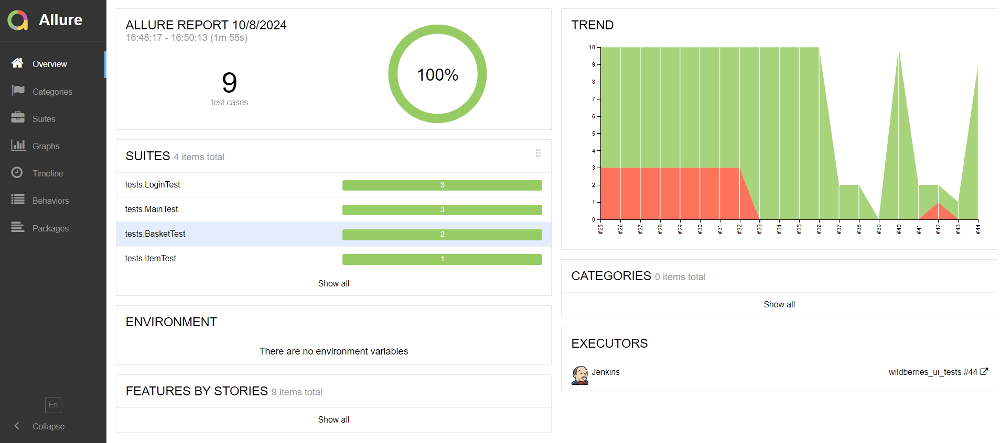

# Проект по автоматизации тестовых сценариев для компании <p align="center"><a href = "https://www.wildberries.ru"></a></p>

___
## :notebook: Содержание:

___
- [Использованный стек](#computer-использованный-стек)
- [Запуск тестов из терминала](#arrow_forward-запуск-тестов-из-терминала)
- [Сборка в Jenkins](#-Сборка-в-Jenkins)
- [Пример Allure-отчета](#-Пример-Allure-отчета)
- [Уведомления в Telegram с использованием бота](#-Уведомления-в-Telegram-с-использованием-бота)
- [Видео примера запуска тестов в Selenoid](#movie_camera-Видео-примера-запуска-тестов-в-Selenoid)

### :computer: Использованный стек
___
<p align="center">
<a href = "https://allurereport.org/"></a>
<a href = "https://qameta.io/"></a>
<a href = "https://github.com/"></a>
<a href = "https://gradle.com/"></a>
<a href = "https://www.jetbrains.com/idea/"></a>
<a href = "https://www.java.com/ru/"></a>
<a href = "https://www.jenkins.io/"></a>
<a href = "https://www.atlassian.com/ru/software/jira"></a>
<a href = "https://junit.org/junit5/"></a>
<a href = "https://ru.selenide.org/"></a>
<a href = "https://aerokube.com/selenoid/"></a>
<a href = "https://telegram.org/"></a>
</p>

- В проекте написаны автотесты  на языке Java с использованием фреймворка для тестирования Selenide.
- В качестве сборщика был использован - Gradle.
- Использованы фреймворки JUnit 5 и [Selenide](https://selenide.org).
- При прогоне тестов браузер запускается в [Selenoid](https://aerokube.com/selenoid/).
- Для удаленного запуска реализована джоба в Jenkins с формированием Allure-отчета и отправкой результатов в Telegram при помощи бота.
- Осуществлена интеграция с Allure TestOps и Jira

#### Allure-отчет содержит:

- Шаги теста;
- Скриншот страницы на последнем шаге;
- Page Source;
- Логи браузерной консоли;
- Видео выполнения автотеста.

___

### :arrow_forward: Запуск тестов из терминала

```
gradle clean wildberriesTest
```

При выполнении команды, тесты запустятся удаленно в <code>Selenoid</code>.

Удаленный запуск с использованием Jenkins+Selinoid

```
gradle clean test -Denv=wildberriesTest
```

###  Сборка в Jenkins

<p align="center">

</p>

###  Пример Allure-отчета
___
#### Overview

<p align="center">

</p>

#### Результат выполнения теста

<p align="center">

</p>

####  Интеграция с Allure TestOps
___

<p align="center">

</p>

####  Интеграция с Jira
___

<p align="center">

</p>

###  Уведомления в Telegram с использованием бота
___
После завершения сборки, бот созданный в <code>Telegram</code>, автоматически обрабатывает и отправляет сообщение с результатом.

<p align="center">

</p>

### :movie_camera: Видео примера запуска тестов в Selenoid

К каждому тесту в отчете прилагается видео прогона.
<p align="center">
  
</p>